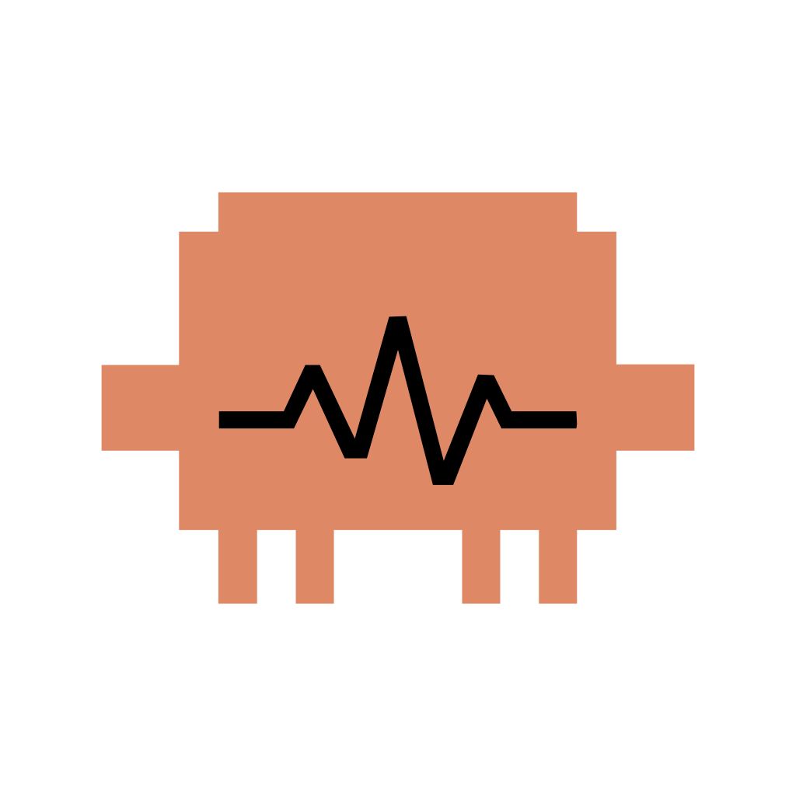

# ClaudePulse

ClaudePulse is a tiny macOS menu bar app for watching Claude desktop usage without sending any data off your Mac.

ClaudePulse reads Claude Desktop's local encrypted cookies, calls Claude's own usage endpoint, and falls back to local storage scans. If it cannot get exact usage, it says so clearly instead of estimating.



## What It Shows

- 5-hour usage from Claude's official usage endpoint
- Weekly usage from Claude's official usage endpoint
- Reset time or reset date when present
- Current Claude plan/product label when present
- Source, source path, cache/stale state, Claude version, and last error in Diagnostics

The menu bar can show:

- Both: `5h 91% W 90%`
- 5h only: `5h 91%`
- Weekly only: `W 90%`
- Unavailable: `Usage unavailable`

## Install

Before using ClaudePulse, install and open the official Claude app at least once:

- `/Applications/Claude.app`

Then:

1. Download `ClaudePulse-macos-universal.dmg` from the latest GitHub release.
2. Open the DMG.
3. Drag `ClaudePulse.app` into `Applications`.
4. Open it once.

The download is a universal binary: it runs natively on both Apple Silicon and Intel Macs, with no Rosetta needed on either.

The zip artifact, `ClaudePulse-macos-universal.zip`, is also available for manual installs or troubleshooting.

Because this early release is ad-hoc signed, macOS may block the first launch. If that happens, right-click `ClaudePulse.app`, choose **Open**, then confirm. After that, it opens normally.

## Using ClaudePulse

After launch, ClaudePulse appears in your macOS menu bar as a small pulse-cloud icon with your selected usage text beside it.

If Claude is not installed, signed out, or missing readable session cookies, ClaudePulse explains that in the menu and offers an **Open Claude Usage** action.

Open the menu to:

- refresh usage data immediately
- open Claude
- open Preferences
- turn Launch at Login on or off
- check each available usage window
- check for updates
- quit the app

## Preferences

ClaudePulse includes a small Preferences window for the things you may want to tune:

- choose whether the top bar shows both windows, 5h only, or weekly only
- show remaining percent, used percent, or both
- switch the app language between System, English, Simplified Chinese, and Traditional Chinese
- refresh every 30 seconds, 60 seconds, or 5 minutes
- opt in to low-limit and stale-data notifications
- review Diagnostics with source path, cache state, Claude version, last refresh, and last error details

Notifications are off by default. If you enable them, macOS will ask for permission the first time.

## Privacy

ClaudePulse runs locally on your Mac.

It reads these local Claude locations:

- `/Applications/Claude.app`
- `~/Library/Application Support/Claude/Cookies`
- `~/Library/Application Support/Claude/Local Storage/leveldb`
- `~/Library/Application Support/Claude/IndexedDB`
- `~/Library/Application Support/Claude/Session Storage`
- `~/Library/Logs/Claude`

ClaudePulse uses Claude Desktop's local encrypted cookies to make an authenticated read request to `https://claude.ai/api/organizations/<organization>/usage`, the same usage endpoint Claude Desktop uses. It does not send telemetry, does not contact third-party services, and does not print or display cookie values.

## Requirements

- macOS 13 or newer
- Apple Silicon or Intel Mac
- The official Claude app installed at `/Applications/Claude.app`
- Claude opened and signed in at least once on the same Mac

## For Developers

Build and package locally:

```sh
swift test
scripts/build-release.sh
scripts/package-dmg.sh
scripts/package-zip.sh
```

The app bundle, DMG, and zip are created in `dist/`.
Each packaging script also writes a `SHA-256` checksum file next to its artifact (a `.sha256` file), so a downloaded DMG or zip can be verified against the published hash.

`scripts/build-release.sh` produces a universal `arm64` + `x86_64` binary by building each architecture separately and merging them with `lipo`, and the packaging scripts name their artifacts after the slices the binary actually carries. Building each slice on its own keeps the Xcode Command Line Tools sufficient — a single `swift build` given several `--arch` flags would instead need full Xcode, which supplies the `xcbuild` the Command Line Tools do not.

For a faster single-architecture local build, set `CLAUDEPULSE_ARCHS`:

```sh
CLAUDEPULSE_ARCHS=arm64 scripts/build-release.sh
```

Optional notarization support can be added later through `scripts/notarize.sh` once a Developer ID certificate is available.

## License

ClaudePulse is released under the MIT License. See `LICENSE` for details.
